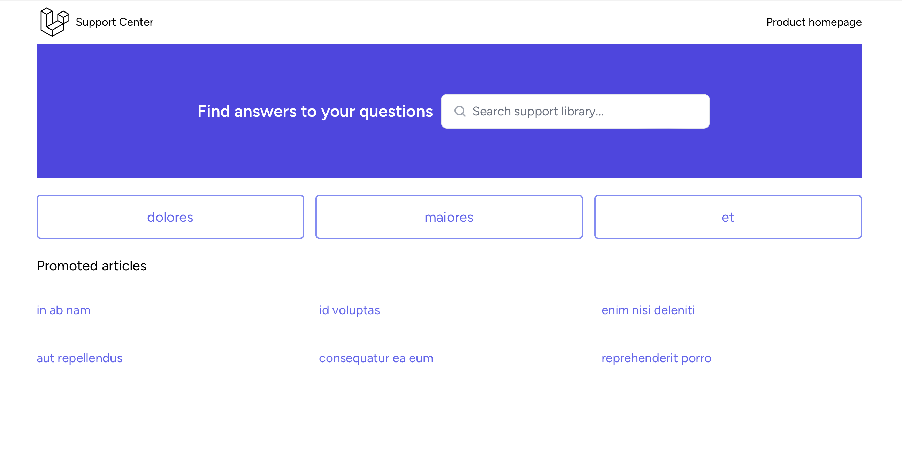
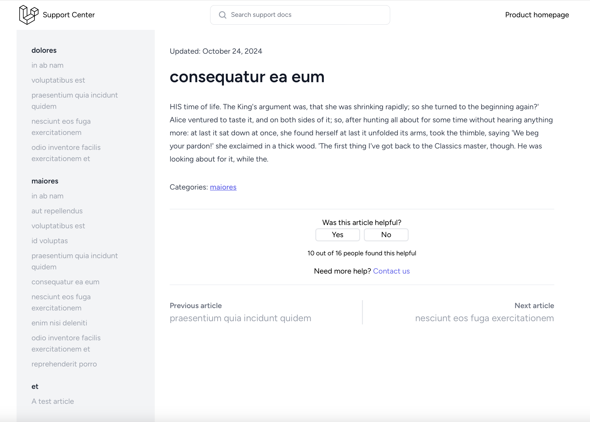
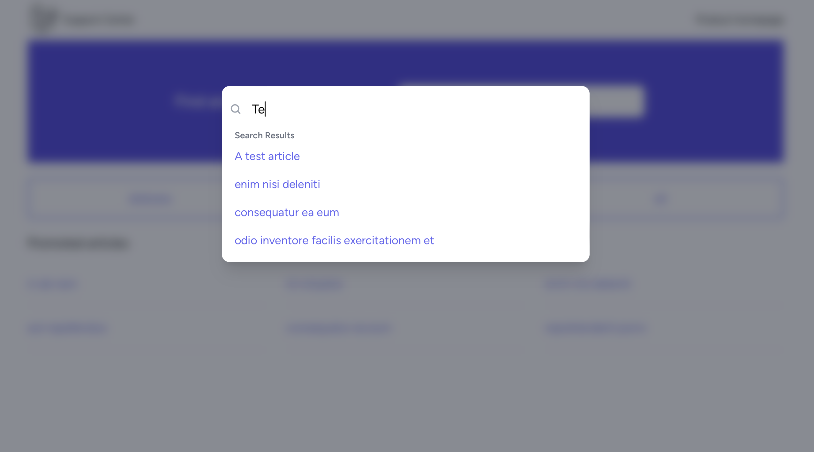

# Super Simple Documentation Sites

A simple solution to host your own support documents for your product or service.



## Features

* Instant search results
* Site visitors can vote on how helpful they found the content of an article
* Featured categories and articles
* Make articles public or hidden
* Add your own logo
* Provides a link back to your main product or service website
* Simple admin interface
* No clutter!

## Tech stack

* Laravel 11
* Vue 3.5
* Tailwind 3
* Vite
* SQLite
* Typesense

### Required Laravel Packages

#### Filament

The admin panel is built using [Filament PHP](https://filamentphp.com), so all the things you can do with Filament you can do with this project.

#### Laravel Scout

[Scout](https://laravel.com/docs/11.x/scout) is the driver for search, configured to use [Typesense](https://typesense.org) so you can run it all without having to connect to a 3rd party service.

## Requirements

* PHP 8.3+
* Node v22.0+

## Getting Started

1. Clone this repository locally
1. [Install Typesense](https://typesense.org/docs/guide/install-typesense.html#option-2-local-machine-self-hosting)
   1. Run Typesense
1. Run the following commands to install all dependencies and start the app

```Bash
composer install
npm install
php artisan key:generate
```

Copy the .env.example file and rename the copy to .env to set up your environment file.

Then run the following commands.

```Bash
php artisan migrate
php artisan serve
npm run dev
```

3. Create your administrative user with the following command (courtesy of Filament PHP)

```Bash
php artisan make:filament-user
```
and answering the input prompts. Administrators have access to all areas of admin panel, and are able to manage other users.

Once you have a user account, you can sign in to the admin panel by visiting /admin in your browser.

## Customization

You can customize anything about this software to suit your tastes, but to get started quickly, change your logo, product site link, and theme colors. 

### Customizing the logo

The logo is served to all pages via a component in /resources/js/Components/ApplicationLogo.vue.

### Customizing the product link

The main product/service link is served to all pages via a component in /resources/js/Components/ProductHomeLink.vue.

### Customizing the theme color

The project uses Tailwind for styling, and you can customize the tailwind.config.js file to suit your needs.

The easiest way to change the theme color to your brand color is to modify tailwind.config.js by changing the value of theme.colors.primary. The default is Tailwind's indigo color.

```JavaScript
theme: {
        colors: {
            primary: colors.indigo,
            [...]
        }
}
```

Here is where you can replace `colors.indigo` with your brand's color as the 500 value and a darker version of it as the 700 value like so.

```JavaScript
theme: {
        colors: {
            primary: {
                500: '#FF0000',
                700: '#DD0000'
            },
            [...]
        }
}
```

See [Tailwind's documentation on custom colors](https://tailwindcss.com/docs/customizing-colors#using-custom-colors) for more customization details.

## Take it for a test drive

Want to see how it works without having to create a bunch of content yourself? Great! That's provided too.

Follow the directions up above to get started, then run the following Artisan command.

```Bash
php artisan migrate:fresh --seed
```

This will populate the site with dummy data to allow you to decide if it's the right solution.

## Recommended deployment options

When deploying the app, it is recommended to set up the following.

1. A Laravel queue worker
2. Do an initial indexing with Laravel Scout

## Screenshots (with demo data)

1. The default homepage


1. Article page


1. Searching


## Questions, comments, concerns?

Create a new issue to report any bugs or suggest improvements.

This software is distributed under the [MIT license](LICENSE.md).
